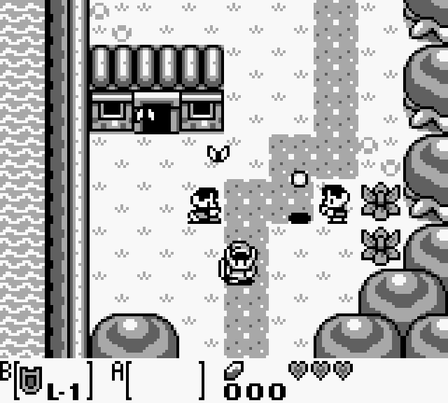

## 1 - Legend of Zelda: Link's Awakening
While trying not to make this list full nostalgia bait, a borrowed gameboy pocket is what started it all. Every screen, every dungeon room was intriguing. Everything here clicked in my brain and captivated me like nothing else had. Ten year old me - not band or sports or social conversations - this game spoke to me internally. Explore, search, find, dig, rush that boss, keep looking for answers. 

This game taught me that fun for fun's sake is of value.

## 2 - Pokemon Gold
When I saved up yard mowing money and bought my own purple clear gameboy color, Pokemon Gold kept me for years. Again, an entire dense world in my pocket yet different. Slightly larger and a bit more lived in. And way more options.

This game taught me that the scope of fiction and imagination can be vast and entirely unknown to the real people around me - except for a few
## 3 - Golden Sun
The gameboy color was usurped by the gameboy advance, and I bought it for Golden Sun. 

This game locked me in as an RPG fan.
## 4 - Fire Emblem GBA
Again but different - turned base battles but grid orientation where placement mattered. And the story!

This game locked me in as a tactics fan.
## 5 - Ico
Ico and Shadow of the Colossus - if you go in blind, it's a fever dream. Large monolithic manmade structures in an empty world.

This game locked me into puzzle games.
## 6 - Half-Life 2
In 2004, my PC could not play this game, but a friend let us play Gary's mod. In college, I felt if I got an xbox 360 like all my friends, I would fail out. I watched a friend fail college playing Mass Effect obsessively and it was a bit in my nature to obsess like that. So when I graduated and built a PC, I booted up Half-Life 2 in 2010 after 6 years. 

This game taught me patience is typically rewarded. 
## 7 - Etrian Odyssey IV
I know of the original - but hadn't really played it. I bought a 3DS for this game. Something to the core of exploration scratches the right itch for me. I've since played I(untold), II(untold), I remastered - am playing V. Have III and Nexus if not II again on my list..... I am likely always playing this series.

This game taught me persistence is joyful. 
## 8 - Dark Souls
Dark Souls also landed at a transitional time - so sometimes I'm not sure if it's the timing or the game that causes it to land on my list - but this one was foundational to not just me, to an entire industry it seemed.

Actually it was this game that taught me persistence is painfully..... rewarding.
## 9 - Deep Rock Galactic
Having played plenty of Halo multiplayer in college or further back, Unreal Tournament and Quake 3, PvE reset what was enjoyable about playing online with friends.

This game taught me the value of friendship. ~cue rainbows~
## 10 - Morrowind
While I had played this in early 2000s, it was aimless. I wouldn't commit to a dedicated play through until 2024. And then that grew into roleplaying my own characters in Tamriel Rebuilt, the mod of more of the world. The amount of content, crafting and just world building that community made is mesmerizing. The fact that it all exists simply because a community wants to make it - is so wonderful.

This game taught me that being aimless is the point of certain games.
## 11 - Talos Principle II
I fucking love laser puzzles.

This game taught me what I already knew - that I fucking love laser puzzles.

Honorable mentions: Duskers, Catrap, Final Fantasy Adventure, Threads of Fate, Legend of Dragoon, Driver 2 / GTA3