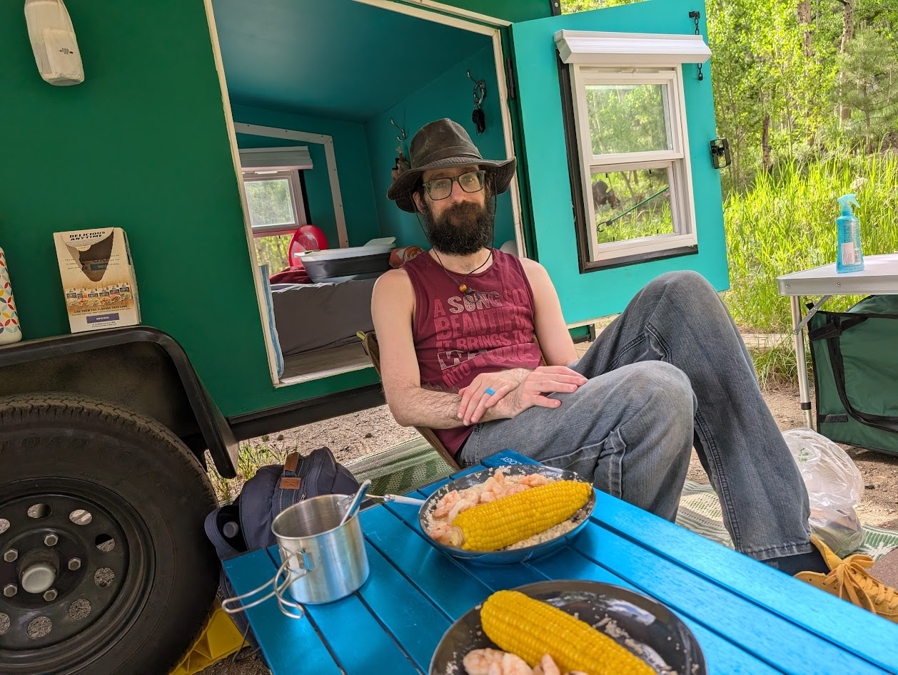
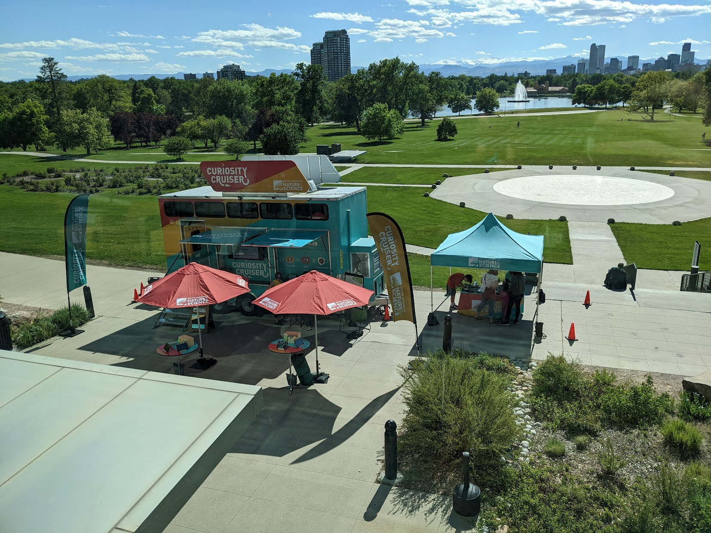
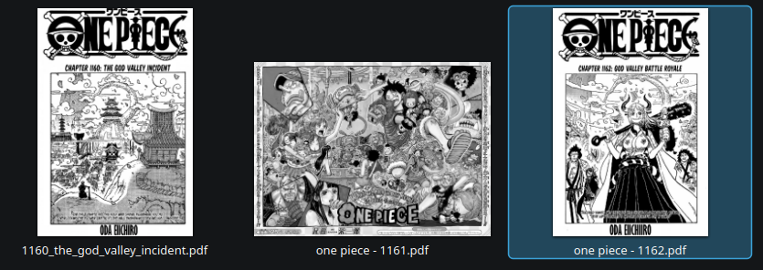

# Hi, I'm [{{ site.name }}](https://www.linkedin.com/in/brasington/)

I am a software engineer at a wonderful [science museum](https://www.dmns.org/). This is a site for projects and writings.

  <!-- Column 1: Skills Chart -->
  

    <h3>Tech Experience</h3>
    <canvas id="experienceChart" style="width:100%; height:300px;"></canvas>
  

  <!-- Column 2: Writings -->
  

    <h3>🖊️ Writings</h3>
    <ul>
      <li><a href="./mods/">Morrowind Modlist</a></li>
      <li><a href="./gaming/ten">10 Games to Get to Know Me</a></li>
      <li><a href="./morrowind/">Tales of Greater Morrowind</a></li>
      <li><a href="./attention/">Tips to reducing psychological “hooks” of the modern internet age</a></li>
    </ul>
    
    <h3>🎮 NextFest Reviews</h3>
    

      <strong>2025:</strong> <a href="https://github.com/chrisbrasington/nextfest/blob/main/2025_October.md" target="_blank">October</a> · <a href="https://github.com/chrisbrasington/nextfest/blob/main/2025_June.md" target="_blank">June</a> · <a href="https://github.com/chrisbrasington/nextfest/blob/main/2025_Feb.md" target="_blank">February</a> 
      <strong>2024:</strong> <a href="https://github.com/chrisbrasington/nextfest/blob/main/2024_June.md" target="_blank">June</a> · <a href="https://github.com/chrisbrasington/nextfest/blob/main/2024_Feb.md" target="_blank">February</a> 
      <strong>2023:</strong> <a href="https://github.com/chrisbrasington/nextfest/blob/main/2023.md" target="_blank">February</a>
    

  

<!-- Column 3: Hobbies -->

  <h3>🛹 Hobbies</h3>

  <table class="scale3-hover" style="margin:0 auto; border-collapse:collapse; border-spacing:12px; border:none;">
    <tr>
      <td style="text-align:center; border:none;">
        <strong>Skateboarding</strong> 
        
      </td>
      <td style="text-align:center; border:none;">
        <strong>Gaming</strong> 
        
      </td>
    </tr>
    <tr>
      <td style="text-align:center; border:none;">
        <strong>Reading</strong> 
        
      </td>
      <td style="text-align:center; border:none;">
        <strong>Camping</strong> 
        
      </td>
    </tr>
  </table>

## </> Professional Projects

| Site | | |
|----------|------------|------------|
| [dmns.org](https://www.dmns.org/) | Denver Museum of Nature & Science |   |
| dmns curiosity cruiser | roving science | 
| dmns kiosk | Payment kiosks | 
| dmns member app | | 
| mitek blackpoint | CAD automation and materials manager | 
| hohmann & barnard | submittal package generation and estimation | 

## </> Projects

| Personal | | |
|----------|------------|------------|
| [github.io](https://github.com/chrisbrasington/chrisbrasington.github.io) | [site](https://chrisbrasington.github.io/), [homepage](https://chrisbrasington.github.io/home/), and [articles](https://chrisbrasington.github.io/attention/) |  |
| Launcher (WIP) | Minimalist launcher / media player |    |

| Manga | | |
|----------|------------|------------|
| [onepiece_dl](https://github.com/chrisbrasington/onepiece_dl) | Download latest one-piece chapter | |
| [manga-downloader-sync](https://github.com/chrisbrasington/manga-downloader-sync) | Download from mangadex / docker support |  |
| [lightnovel-epub-creator](https://github.com/chrisbrasington/lightnovel-epub-creator) | Download from url - create epub|

| Utility | | |
|----------|------------|------------|
| [epub_search](https://github.com/chrisbrasington/epub_search) | Find words within books | Search for multiple words in EPUB files in a directory, and display contextual paragraph and location. 
| [Obsidian Image Cache Script](https://github.com/chrisbrasington/obsidian-image-cache) | Scan markdown files for image metadata | Download images to .cache for performance and/or long-term survivability 
| [MangaDex Covers Downloader](https://github.com/chrisbrasington/mangadex-covers) | Generate cover images from MangaDex URL |  | 
| [kobo-to-obsidian-import](https://github.com/chrisbrasington/kobo-to-obsidian-import) | export as markdown | 
| [book-scanner](https://github.com/chrisbrasington/book-scanner) | Use a barcode scanner, scans into database/csv | 
| [image-organizer](https://github.com/chrisbrasington/image-organizer) | CLI tool for sorting images into folders | 
| [obsidian-tagger](https://github.com/chrisbrasington/obsidian-tagger) | Bulk apply tags to a folder of markdown files
| [discord-canary-updater](https://github.com/chrisbrasington/discord-canary-updater) | Automates update of .deb discord canary
| [obsidian-sort](https://github.com/chrisbrasington/obsidian-sort) | manages sort metadata value for folder of mardown files
| [obsidian cover url updater](https://github.com/chrisbrasington/markdown-coverimage-fixer) | If images are not found online, allow user to update | 
| [garmin data parse to obsidian chart](https://github.com/chrisbrasington/garmin) | Converts garmin sleep or activity data into dataview
| [obsidian search](https://github.com/chrisbrasington/obsidiansearch) | commandline utility for search markdown files | 

| Security | | |
|----------|------------|------------|
| [ssh-attempt log analyzer](https://github.com/chrisbrasington/ssh-attempts) | script analyzes SSH login logs (auth.log*)

| Gaming | | |
|----------|------------|------------|
| [morrowind-mod-tracker](https://github.com/chrisbrasington/morrowind-mod-tracker) | Reads mod directory, produces markdown | 
| [bestset](https://github.com/chrisbrasington/bestset) | Create "best set" of ROMS | Search multiple folders and copy cleaned file-names to a directory per game system folder (PS1, GBA, etc) 
| [launch modifier](https://github.com/chrisbrasington/morrowind_launcher) | Launch openMW or openRTC (rollercoaster tycoon) | Compatible to steam game time recording
| [3DS save sync](https://github.com/chrisbrasington/3ds-save-sync) | Sync checkpoint saves between two 3DSes | 
| [psp-psx save sync and converter](https://github.com/chrisbrasington/psp_psx_save_sync) | Supports 2 different save types and movement - useful for PSP hardware and emulators | 
| [steam deck image pull](https://github.com/chrisbrasington/steamdeck-screenshot-pull) | Pull steamdeck screenshot folder to PC
| [leap motion swipe detectoin](https://github.com/chrisbrasington/leap_motion) | Detects swipe motion on leap motion device
| [switch capture script](https://github.com/chrisbrasington/nintendoswitch-card-capture) | Nintendo Switch using mpv, while routing the audio using PulseAudio loopback | 
| [steam icon fix](https://github.com/chrisbrasington/steam-icon-fix-linux) | parses icon-cache | 
| [disgaea-macro-generator (windows only)](https://github.com/chrisbrasington/disgaea-macro-generator) | uses autohotkey | 
| [final fantasy PR auto-battler (windows only)](https://github.com/chrisbrasington/final-fantasy-auto-auto-battle) | uses autohotkey, has battle detection | 

| Fun | | |
|----------|------------|------------|
| [denver-skyimage](https://github.com/chrisbrasington/denver-skyimage) | timelapse | 
| [washer-dryer-pushover-status-monitor-ESP8266](github.com/chrisbrasington/washer-dryer-pushover-status-monitor-ESP8266) | Get a text when washer/dryer done shaking

| Discord BOT  | | |
|----------|------------|------------|
| [onepiece_dl](https://github.com/chrisbrasington/onepiece_dl) | Download latest one-piece chapter | Bot commands for latest or by chapter number / url|
| [screenshot-bot](https://github.com/chrisbrasington/screenshot-bot) | Steam support |  
| [discord game turn bot](https://github.com/chrisbrasington/discord-game-turn-bot) | Used to manage a game of telephone |  
| [discord event bot](https://github.com/chrisbrasington/discord-deep-rock-event-bot) | Obsolete, but does respond to "rock and stone"
| [sonic bot](https://github.com/chrisbrasington/sonic-bot) | Uses [VADER](https://vadersentiment.readthedocs.io/en/latest/) sentiment to response positive/negative/neutral

| DotFiles (sway) | | |
|----------|------------|------------|
| [dotfiles](https://github.com/chrisbrasington/dotfiles) | sway | 

| OLD music theory | | |
|----------|------------|------------|
| [ruby music theory](https://github.com/chrisbrasington/ruby-music-theory)
| [ardunino midi LED](https://github.com/chrisbrasington/arduino-piano)
| [euterpea-studies](https://github.com/chrisbrasington/Euterpea-Study)

| Obsolete / Unmaintained  OLD | | |
|----------|------------|------------|
| [hackathon-led](https://github.com/chrisbrasington/hackathon-led) | | 
| [obsidian - light-novel-markdown-creator](https://github.com/chrisbrasington/light-novel-markdown-creator) | Use [obsidian-book-search-plugin](https://github.com/anpigon/obsidian-book-search-plugin) which added manga support
| [quicktask](https://github.com/chrisbrasington/quicktask) | Creates quick task markdown for obsidian | Abandoned for google keep and/or manual obsidian entry
| [jameswebb-downloader](https://github.com/chrisbrasington/jameswebb-downloader)
| [audiobook parser/synchronization app](https://github.com/chrisbrasington/audiobook-sync-app) | uses author/title | 
| [discord-anything-status](https://github.com/chrisbrasington/discord-anything-status)
| [comic books weekly RSS](https://github.com/chrisbrasington/comic-books-weekly)
| [gnucash savings report](https://github.com/chrisbrasington/gnucash-savings)
| [gnucash budge report](https://github.com/chrisbrasington/gnucash-budget)
| [gnucash from text message](https://github.com/chrisbrasington/text-messaging-to-gnucash)
| [speedtest randomizer runs](https://github.com/chrisbrasington/speedtest-randomizer)
| [RTD Transit Feed parser](https://github.com/chrisbrasington/rtd)
| [tunefind playlist generator](https://github.com/chrisbrasington/tunefind-playlist-generator)
| [lastfm googlemusic playlist generator](https://github.com/chrisbrasington/lastfm-googlemusic-playlist-generator)
| [crawl stone soup stats](https://github.com/chrisbrasington/crawl-stats) | go play [dungeon crawl stone soup](https://crawl.develz.org/)
| [guildwars javascript api wrapper](https://github.com/chrisbrasington/guildwars2-javascript-api-wrapper)
| [LBN511-hack](https://github.com/chrisbrasington/LBN511-hack)
| [lastfm website](https://github.com/chrisbrasington/lastfm-website)