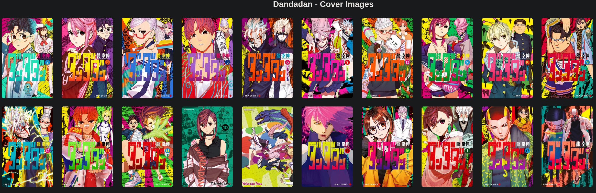

# Hi, I'm {{ site.name }} 

## 💻 Skills

| Tech     | Experience |
|----------|------------|
| C#       | {{ site.time | date: "%Y" | minus: page.csharp_start }} years |
| Python       | {{ site.time | date: "%Y" | minus: page.python_start }} years |
| [Obsidian.md](https://obsidian.md/) | {{ site.time | date: "%Y" | minus: page.obsidian_start }} years |
| Linux      | {{ site.time | date: "%Y" | minus: page.linux_start }} years |
| Obsidian   | {{ site.time | date: "%Y" | minus: page.obsidian_start }} years |
| Blazor     | {{ site.time | date: "%Y" | minus: page.blazor_start }} years |
| MAUI       | {{ site.time | date: "%Y" | minus: page.maui_start }} years |
| Umbraco    | {{ site.time | date: "%Y" | minus: page.umbraco_start }} years |
| Kotlin     | {{ site.time | date: "%Y" | minus: page.kotlin_start }} years |
| Arduino    | {{ site.time | date: "%Y" | minus: page.arduino_start }} years |

## 🖊️ Writings
[Tips to reducing pychological “hooks” of the modern internet age](./attention/)

## </> Projects

| Site | | |
|----------|------------|------------|
| [github.io](https://github.com/chrisbrasington/chrisbrasington.github.io) | [site](https://chrisbrasington.github.io/), [homepage](https://chrisbrasington.github.io/home/), and [articles](https://chrisbrasington.github.io/attention/) |  |

| Android | | |
|----------|------------|------------|
| Launcher (private) | WIP Minimalist launcher / media player |  |

| Manga | | |
|----------|------------|------------|
| [onepiece_dl](https://github.com/chrisbrasington/onepiece_dl) | Download latest one-piece chapter | |
| [manga-downloader-sync](https://github.com/chrisbrasington/manga-downloader-sync) | Download from mangadex / docker support |  |
| [lightnovel-epub-creator](https://github.com/chrisbrasington/lightnovel-epub-creator) | Download from url - create epub|

| Utility | | |
|----------|------------|------------|
| [epub_search](https://github.com/chrisbrasington/epub_search) | Find words within books | Search for multiple words in EPUB files in a directory, and display contextual paragraph and location. 
| [Obsidian Image Cache Script](https://github.com/chrisbrasington/obsidian-image-cache) | Scan markdown files for image metadata | Download images to .cache for performance and/or long-term survivability 
| [MangaDex Covers Downloader](https://github.com/chrisbrasington/mangadex-covers) | Generate cover images from MangaDex URL |  | 
| [kobo-to-obsidian-import](https://github.com/chrisbrasington/kobo-to-obsidian-import) | export as markdown | 
| [book-scanner](https://github.com/chrisbrasington/book-scanner) | Use a barcode scanner, scans into database/csv | 
| [image-organizer] | CLI tool for sorting images into folders | 
| [obsidian-tagger](https://github.com/chrisbrasington/obsidian-tagger) | Bulk apply tags to a folder of markdown files
| [discord-canary-updater](https://github.com/chrisbrasington/discord-canary-updater) | Automates update of .deb discord canary
| [obsidian-sort](https://github.com/chrisbrasington/obsidian-sort) | manages sort metadata value for folder of mardown files
| [obsidian cover url updater](https://github.com/chrisbrasington/markdown-coverimage-fixer) | If images are not found online, allow user to update | 

| Security | | |
|----------|------------|------------|
| [ssh-attempt log analyzer](https://github.com/chrisbrasington/ssh-attempts) | script analyzes SSH login logs (auth.log*)

| Gaming | | |
|----------|------------|------------|
| [morrowind-mod-tracker](https://github.com/chrisbrasington/morrowind-mod-tracker) | Reads mod directory, produces markdown | 
| [bestset](https://github.com/chrisbrasington/bestset) | Create "best set" of ROMS | Search multiple folders and copy cleaned file-names to a directory per game system folder (PS1, GBA, etc) 
| [launch modifier](https://github.com/chrisbrasington/morrowind_launcher) | Launch openMW or openRTC (rollercoaster tycoon) | Compatible to steam game time recording
| [3DS save sync](https://github.com/chrisbrasington/3ds-save-sync) | Sync checkpoint saves between two 3DSes | 
| [steam deck image pull](https://github.com/chrisbrasington/steamdeck-screenshot-pull) | Pull steamdeck screenshot folder to PC
| [leap motion swipe detectoin](https://github.com/chrisbrasington/leap_motion) | Detects swipe motion on leap motion device

| Fun | | |
|----------|------------|------------|
| [denver-skyimage](https://github.com/chrisbrasington/denver-skyimage) | timelapse | 

| Discord BOT  | | |
|----------|------------|------------|
| [onepiece_dl](https://github.com/chrisbrasington/onepiece_dl) | Download latest one-piece chapter | Bot commands for latest or by chapter number / url|
| [screenshot-bot](https://github.com/chrisbrasington/screenshot-bot) | Steam support |  
| [discord game turn bot](https://github.com/chrisbrasington/discord-game-turn-bot) | Used to manage a game of telephone |  
| [discord event bot](https://github.com/chrisbrasington/discord-deep-rock-event-bot) | Obsolete, but does respond to "rock and stone"

| DotFiles (sway) | | |
|----------|------------|------------|
| [dotfiles](https://github.com/chrisbrasington/dotfiles) | sway | 

| Obsolete | | |
|----------|------------|------------|
| [obsidian - light-novel-markdown-creator](https://github.com/chrisbrasington/light-novel-markdown-creator) | Use [obsidian-book-search-plugin](https://github.com/anpigon/obsidian-book-search-plugin) which added manga support