# Tales of Greater Morrowind
- [Etrian the Hidden Nerevarine](#etria-the-hidden-nerevarine)
- [Raylinth the Silent Wanderer](#raylinth-the-silent-wanderer)
- [Ciel of Narsis](#ciel-of-narsis)

# Etria the Hidden Nerevarine

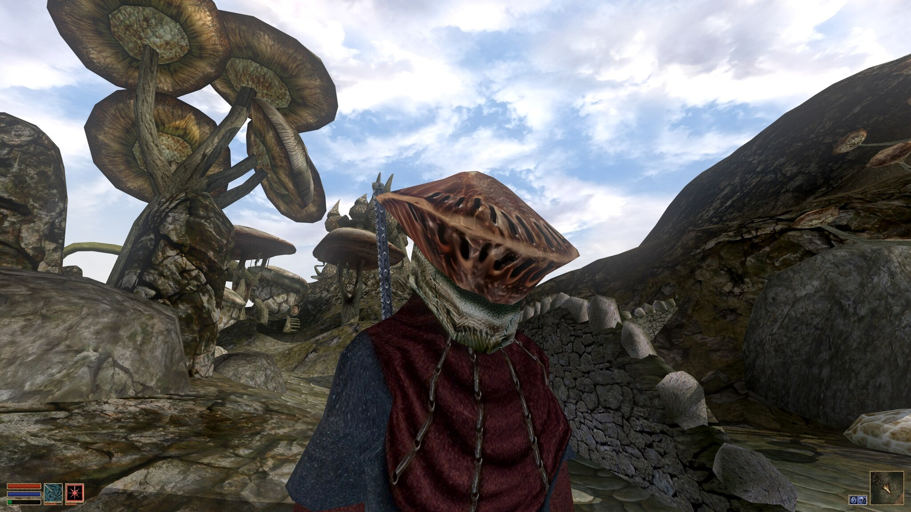

I'll spare you the tale of the savior of `Vvardenfall` and tell you the lesser known details of the Nerevarine.

Etria wore dark red peasant robes, gloves, and hid their race behind a common Redoran watchman's helmet (perhaps for this reason they were hated by the Redoran). Despite being the native race to Morrowind, the dark elves, they never let this show - their pale gloves often being mistaken for Breton. It is perhaps due to the hatred they received from the House Telvanni that Etria found alliance with the House Telvanni - though a great many mysterious deaths of high Telvanni house members occurred at this time.

Etria later wore a second heretical piece - stolen from the High Ordinators of the Tribunal, they wore "Her Hand's" armor shoulder pauldrons, holes cut in their robes, enchanted with an intimidating glow. Perhaps like the Redoran helmet, Etria had a disdain for the governing order of the realms. No doubt pissing off any member of the two clans on sight. 

Etria favored a slinder samurai sword and through either desturction magic or the use of oils, it was said to glow red hot as it would strike their foes down. 

But that was how Etria was - an oursider - and they wore it literally. 

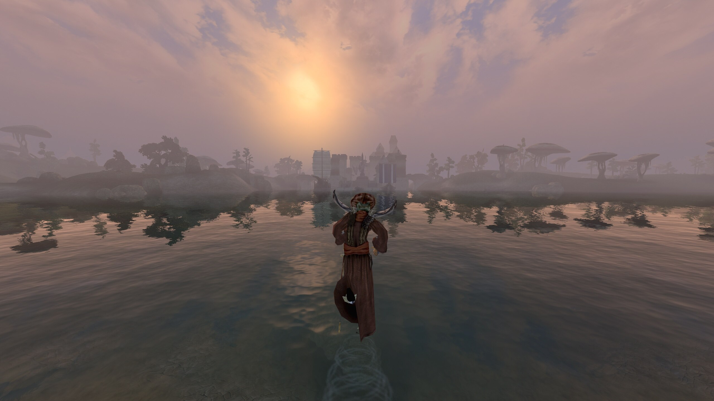

After the Red Ash stopped falling, Etria walked across the water south of Vivec to Old Ebonheart and down the Thirr river. A great many plantations existed along the river, providing goods into the heart of Vvardenfell - but it is said that Etria went on a rampage. Killing every plantation owner and freeing every slave Argonian and Khajit. With their army, they settled in `Roa Dyr` the city of lights, and controled the ports of `Aimrah` to `Almas Thirr`. 

Being Nerevarine bought them a seat at the table of `Old Ebonheart` in the trade route to `Cyrodiil` - having spared the God Vivec, but ultimately killing them to prove a point of forcing change on the land. Upon killing Vivec, Etria is said to have sliced the suspended meteor in half as it crashed between the sea of `Ebonheart` and `Old Ebonheart` - enough of a threat to end slavery for good in the region. It is said that Etria grew bored of stubborn politicians and retired far-far south in the `Black Marshland` of the Argonians they had freed.

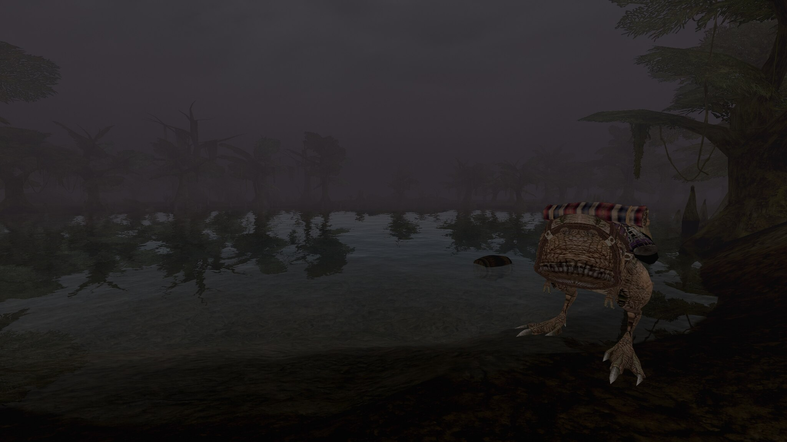

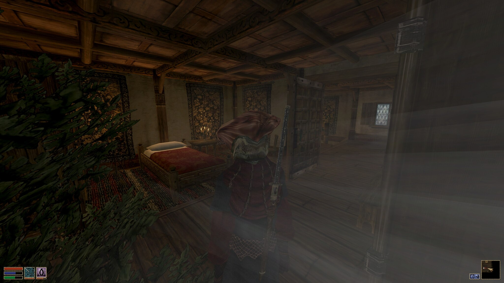

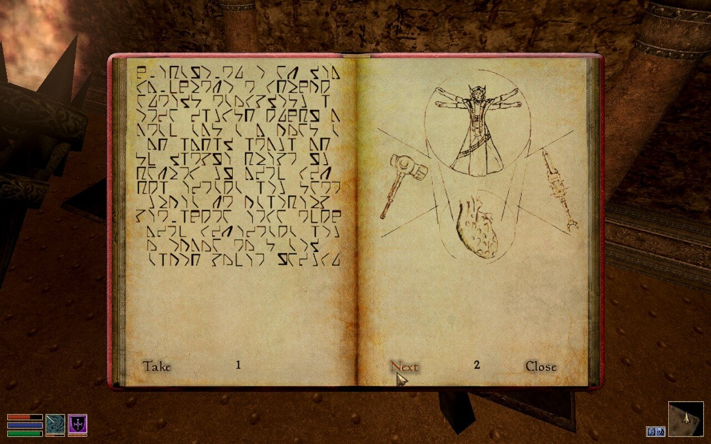

# Raylinth the Silent Wanderer

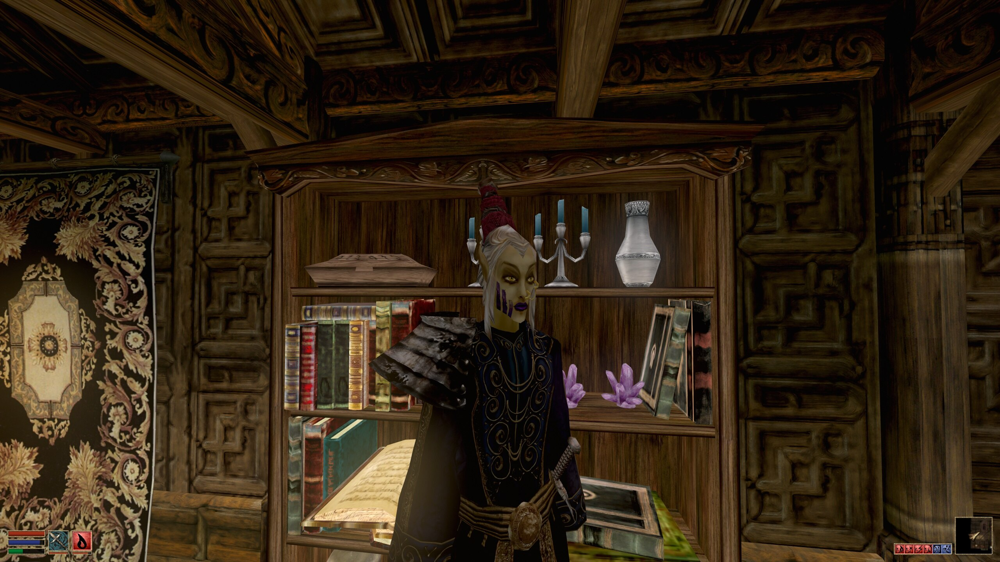

After the disapperance of `Etrian the Nerevarine`, a mysterious robed Breton was seen wandering around `Sedya Neen`. They were unusually tall - wearing their hair straight-up as if to increase their presense. 

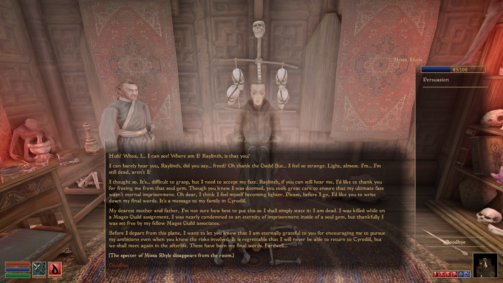

Seemingly doing oddjobs for the mages guil in `Old Ebonheart`, Raylinth unconvered a ploy where a soul of former member, Miss Rhyle, had become trapped in a soul gem. While common in mage circles, Raylinth ultimately was able to free Miss Rhyle having a conversation about her death and freeing her from her entrapment of this plane. Here it is said that Raylinth became obsessed with death - or at least ensuring that souls are able to move on from our mortal plane. 

Soon after quitting the mages guild, a similiarly tall robe figure was seen wandering the coastline far east of `Old Ebonheart` even as far north as `Firewatch`. They wore a `Native Gah-Julan Bonemold Helm` and was known to use explosive destruction magicks. 

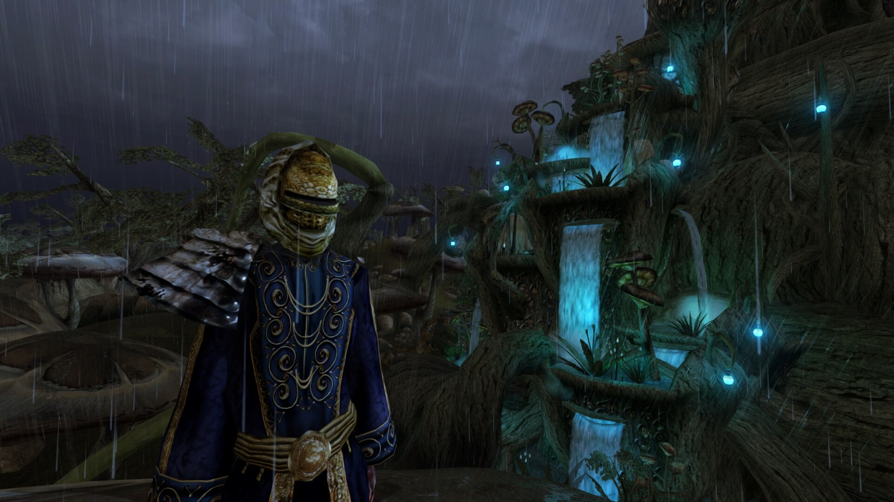

They supposedly spent months in `Akamora` gathering intel on `Necrom`, city of the dead, to the east

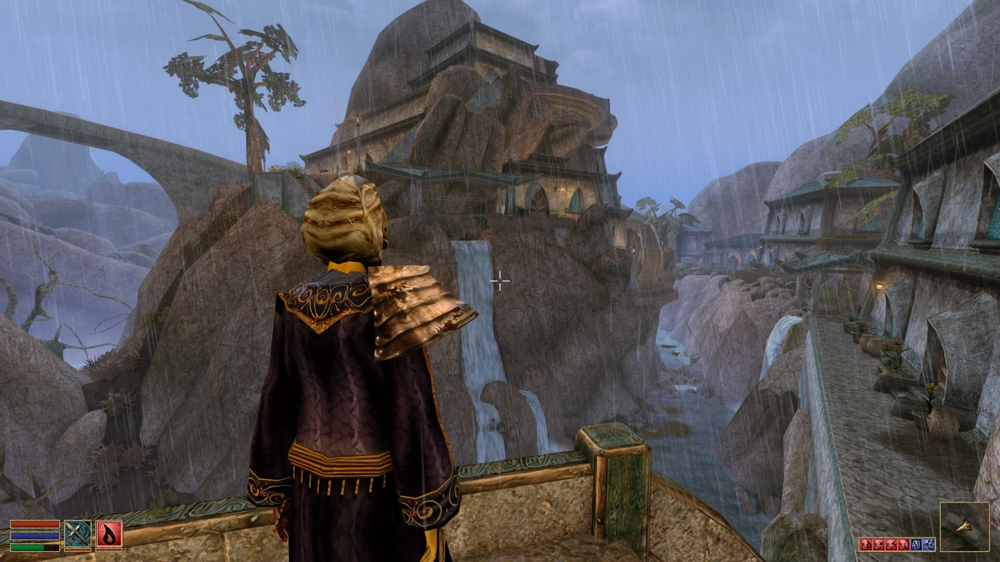

A few months later, an explosion rocked the sacred tombs of `Necrom` city of the dead. Various artifacts were said to be plundered, though `House Indori` would never openly admit to what had occurred. It is believe that Raylinth had infiltrated quietly into the catacombs of the city and after a confrontation with Necrom Ordinators in Mourning - it is said they used explosion magic to blast a hole out of the channelworks and escape by boat East and circumnavigating the world landing in `Hammerfell`. 

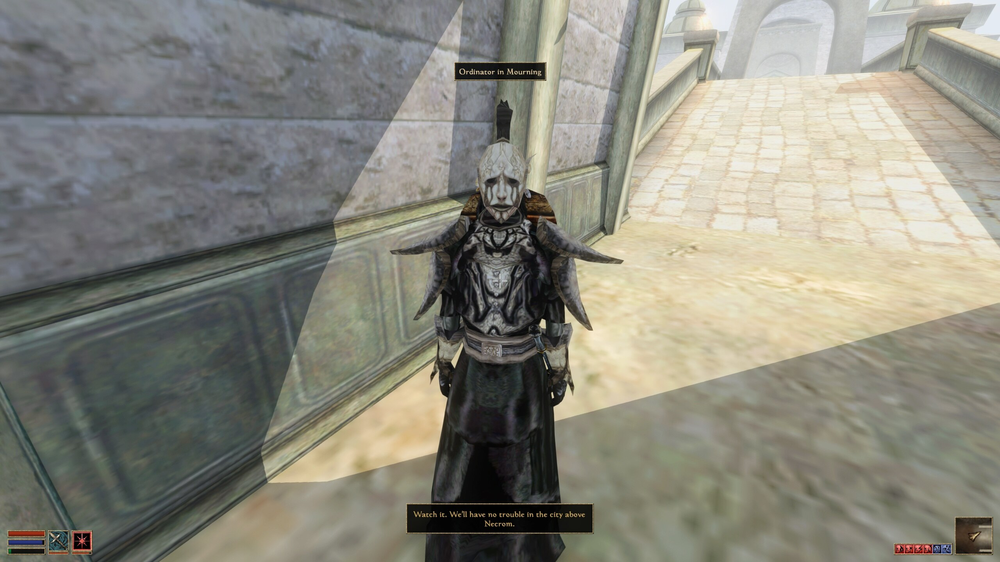

It is unknown what Raylinth found or took from the sacred tombs of `Necrom`. Some say they sook vengenance to free old gods from imprisonment. Others say they stole something to further their exploration in rumored Necromancy - that they were hunting for a particular soul of the dead. All that is known is they escaped certain death for sacrilege from the Ordinators in Mourning and they never returned to Morrowind. 

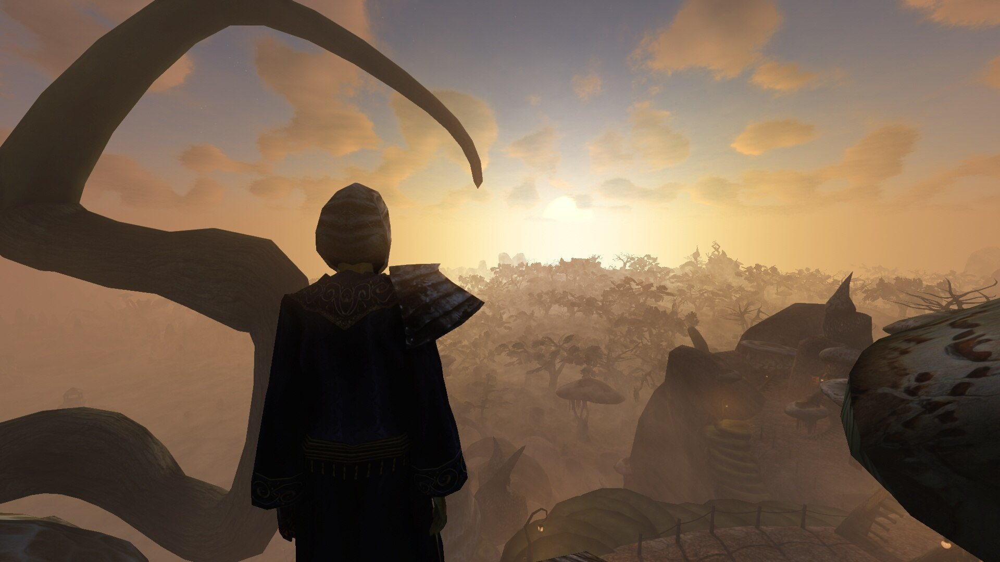
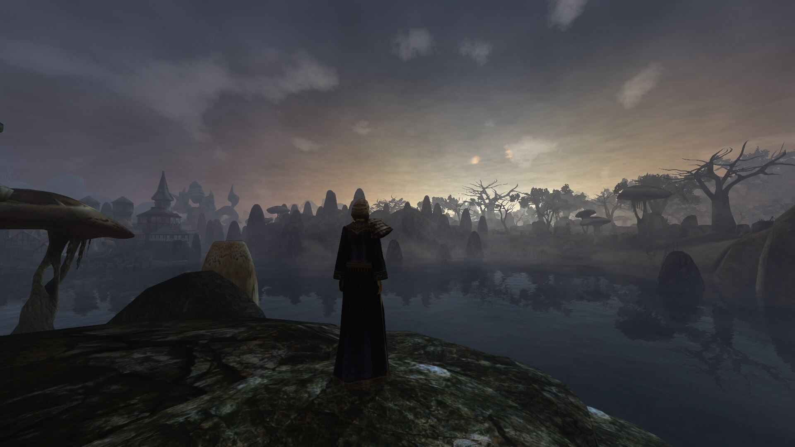

# Ciel of Narsis

TBD

