# Tales of Greater Morrowind (Roleplay)
- [Zhuangzi, the Pilgrim](#zhuangzi-the-pilgrim) (Summer 2026 - TR - prep for Poison Song)
- [Ciel, the Playwright of Narsis](#ciel-the-playwright-of-narsis) (2026 - TR - Grasping Fortune )
- [Raylinth, the Silent Wanderer](#raylinth-the-silent-wanderer) (2025 - Tamriel Rebuilt)
- [Etrian, the Hidden Nerevarine](#etria-the-hidden-nerevarine) (2024 - main playthrough)

# Zhuangzi, the Pilgrim

```
> Roleplay: Monk of the temple
> Goal: `Tamriel Rebuild - Poision Song (unreleased)`
> Weapon: unarmed fists
> House: `Indoril`
> Expansion: `Tamriel Rebuild - Poision Song (unreleased)`
> Region: `Vvardenfell` and `Sundered Scar`
> Guild: Temple
```

Zhuangzi, a monk bearing no weapons (except his fists) and having completed the pilgrimage of the `Seven Graces` to join the temple, Zhuangzi is faced with a decision to continue temple tasks in ``Ald`ruhn`` or to head south out of `Vvardenfell` to join `House Indoril`.

TBD

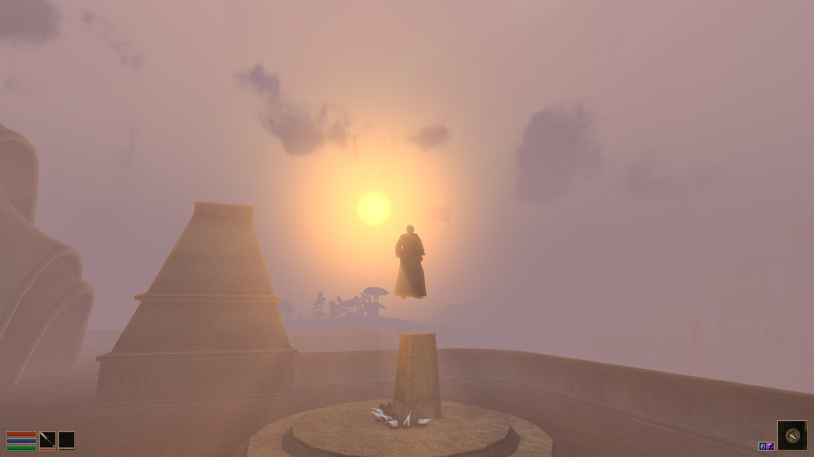
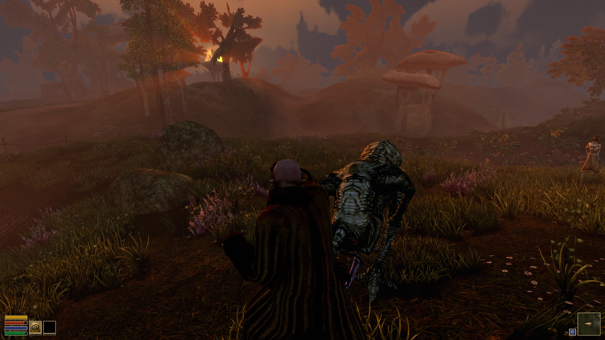
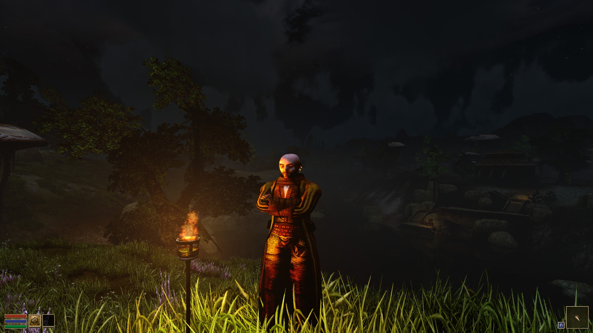
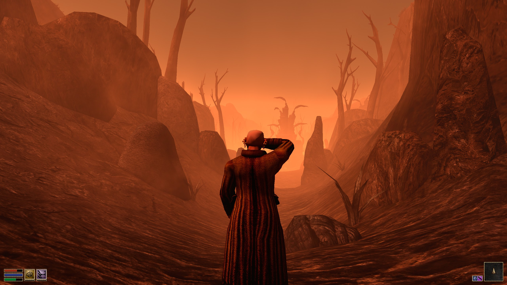
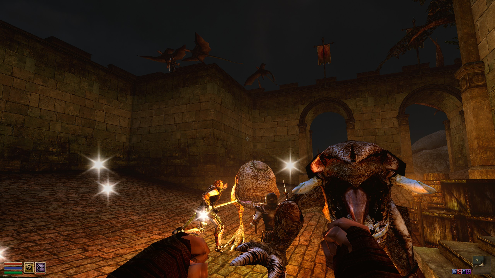
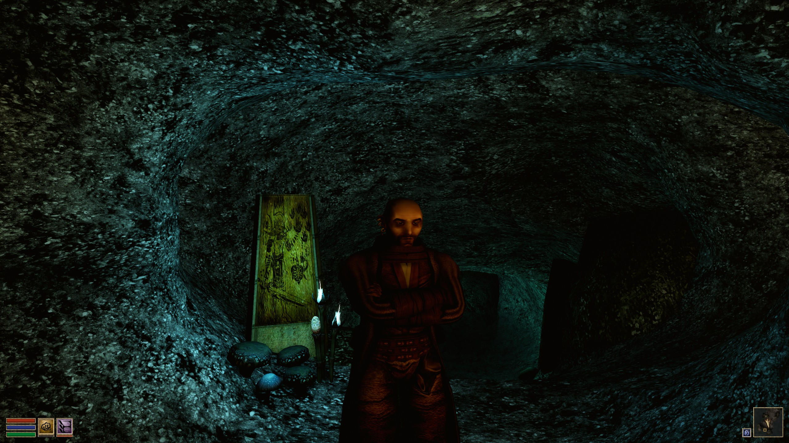

# Ciel, the Playwright of Narsis

```with
> Roleplay: Orc with an axe
> Goal: `Tamriel Rebuild - Grasping Fortune` content, Hlaalu
> Weapon: axe
> House: `Halaal`
> Expansion: `Tamriel Rebuild - Grasping Fortune`
> Region: `Narsis` and `Akamora` (eastern Morrowind)
> Guild: Fighter's Guild
```

From a deep cave system near an undetermined dwenver ruin, came an orc to the city of `Narsis`. An axe-wielder, he was known as `The Mountain Splitter` and `The Chameleon` for a ring that gave him a blending translucence.

He is only called Ciel by performers of the `Hlaalu Theater` and has been see in trading mysterious masks at the `Grand Bazaar`. It is said that when returns from his ventures out East, he returns with a mask to sell and returns with books to the `Hlaalu Theater` - whether by leaning into this rumor or from hearing tales - is likely to announce a new production for the citizens of `Narsis`. He carries a small vail around his waist that is set to contain a voice of an `Ilmeni` as his own voice has never been heard. 

Thus Ciel is best known as `The Playwright` within `Narsis`.

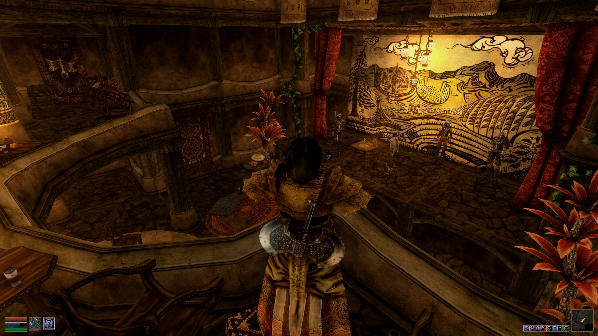
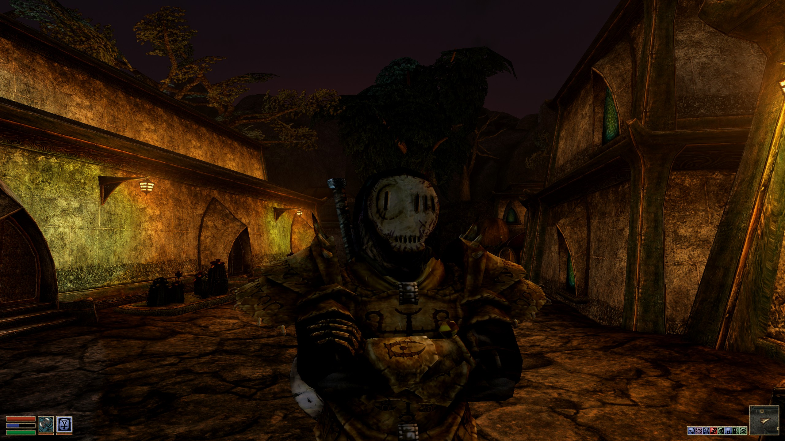

# Raylinth, the Silent Wanderer

```
> Roleplay: Destruction mage
> Goal: older `Tamriel Rebuilt` content, Mages Guild
> Weapon: Destruction magic
> House: `??`
> Expansion: `Tamriel Rebuild - pre-2024 content`
> Region: `Old Ebonheart` and various
> Guild: Mages Guild
```

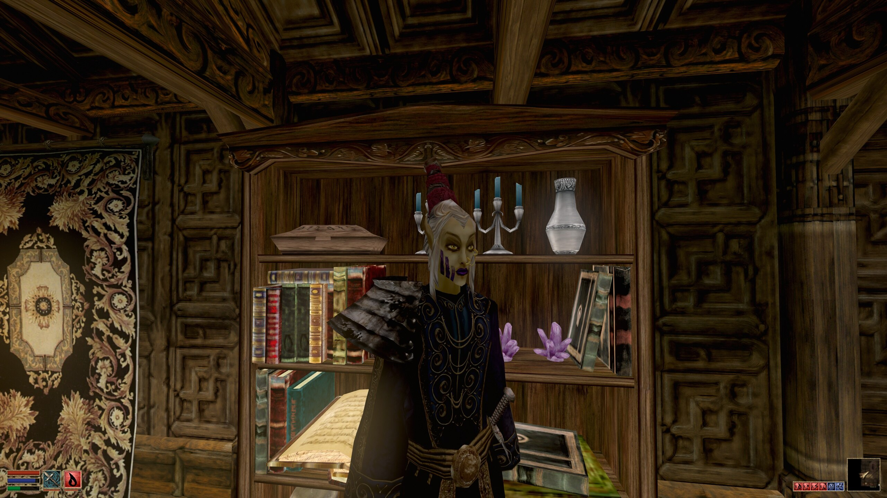

After the disapperance of `Etria the Nerevarine`, a mysterious robed Breton was seen wandering around `Sedya Neen`. They were unusually tall - wearing their hair straight-up as if to increase their presense. 

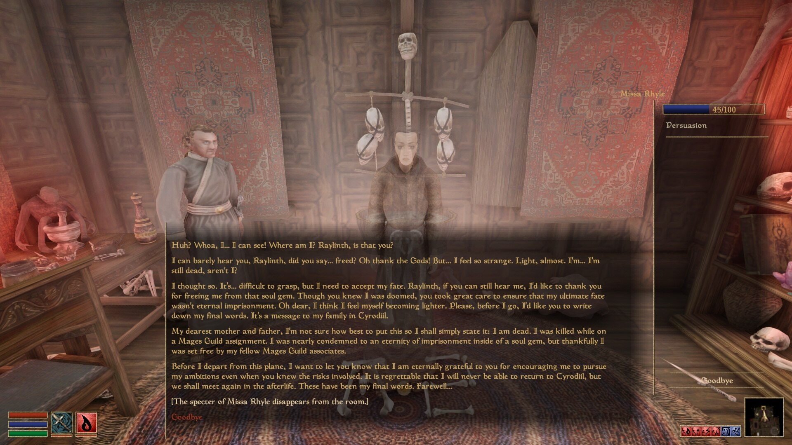

It is rumored that Raylinth witnessed Etria the Nerevarine split the Vivec meteor in half from `Old Ebonheart` and was awed by not only that act, but the protective barrier the mages guild used to save the lower city quarters from the rushing risk wave. Thus Raylinth joined the mages guild.

Seemingly doing oddjobs for the mages guild in `Old Ebonheart`, Raylinth eventually unconvered a ploy where a soul of former member, Miss Rhyle, had become trapped in a soul gem. While soul gems are common in mage circles, Raylinth ultimately was able to free Miss Rhyle having a conversation about her death and freeing her from her entrapment of this plane. Here it is said that Raylinth became obsessed with death - or at least ensuring that souls are able to move on from our mortal plane. 

Soon after quitting the mages guild, a similiarly tall robe figure casting wild magicks was seen wandering the coastline far east of `Old Ebonheart` even as far north as `Firewatch`. They wore a `Native Gah-Julan Bonemold Helm` and was known to use explosive destruction magicks. 

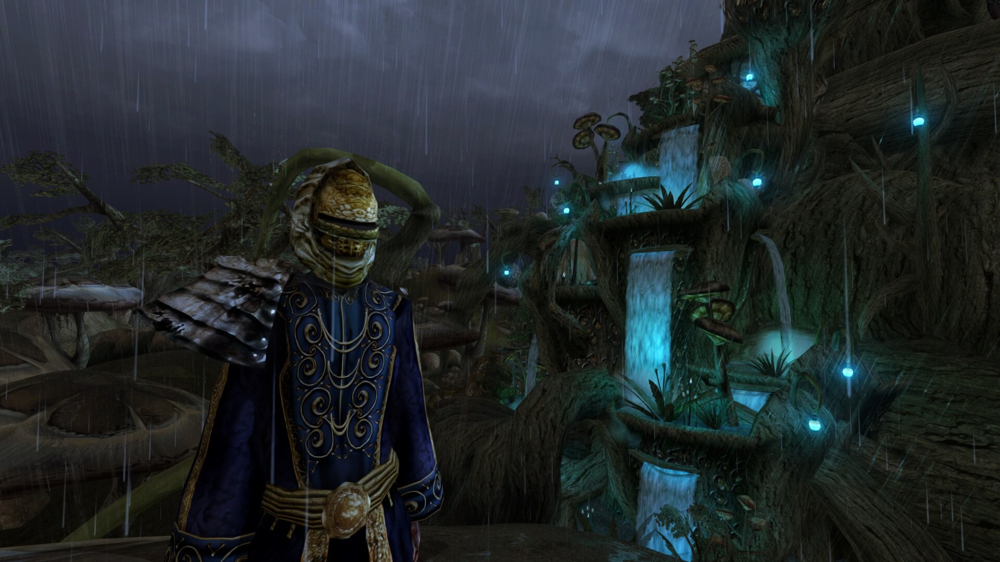

It is an unverified rumor that Raylinth ever met Etria. Let alone was ever a pupil of Etria, but it is long speculated they were sent by Etrian on a pilgrimage to Necrom.

Raylinth supposedly spent months in `Akamora` gathering intel on `Necrom`, city of the dead, to the east. Doing various jobs that took them back and forth between the two cities on a trade route through the rugged mountian terrain. 

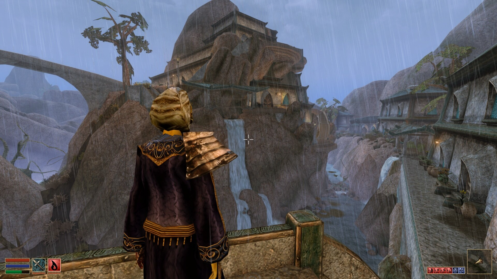

A year later, an explosion rocked the sacred tombs of `Necrom` city of the dead. Various artifacts were said to be plundered, though `House Indori` would never openly admit to what had occurred. It is believe that Raylinth had infiltrated quietly into the catacombs of the city and after a confrontation with Necrom Ordinators in Mourning - it is said they used explosion magic to blast a hole out of the channelworks and escape by boat East and circumnavigating the world landing in `Hammerfell`. 

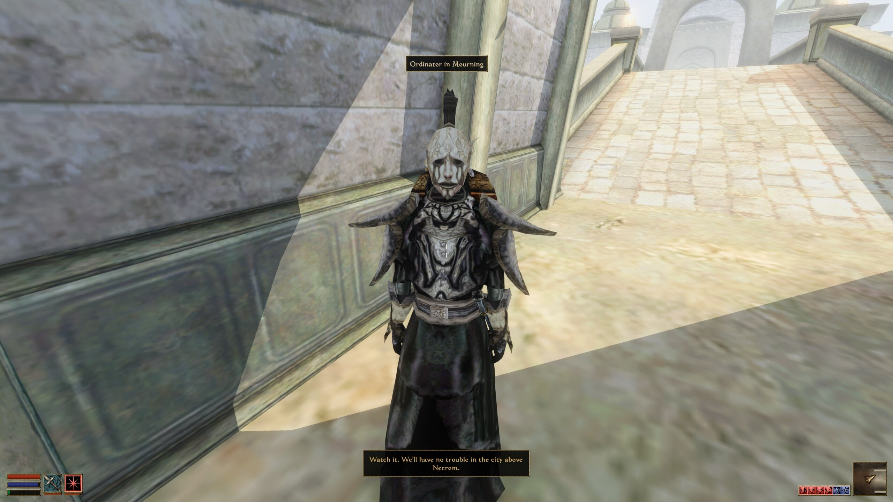

It is unknown what Raylinth found or took from the sacred tombs of `Necrom`. Some say they sought vengenance to free old gods or friends from imprisonment. Others say they stole something to further their exploration in rumored Necromancy - that they were hunting for a particular soul of the dead. All that is known is they escaped certain death for sacrilege from the Ordinators in Mourning and they never returned to Morrowind. 

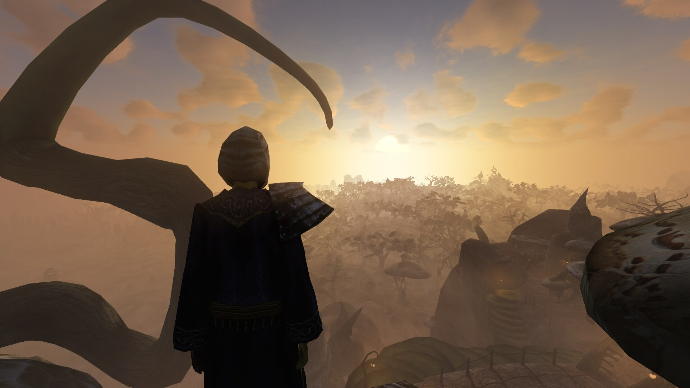
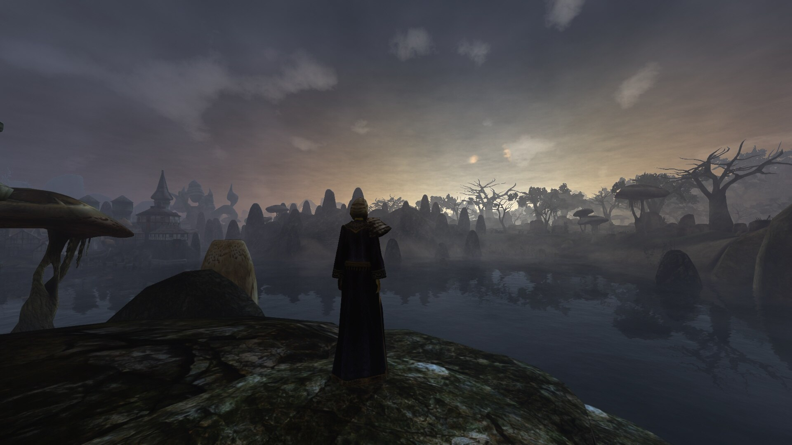
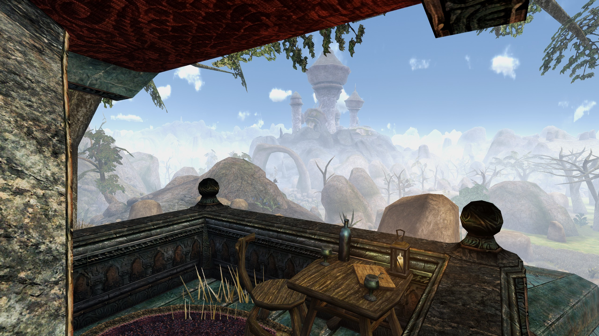

# Etria, the Hidden Nerevarine

```
> Roleplay: Base Game
> Goal: Vanilla experience
> Weapon: Longsword
> House: `Telvani`
> Expansion: Official: `Tribunal` and `Bloodmoon`
> Region: `Vvardenfell` 
> Guild: Mages Guild
```

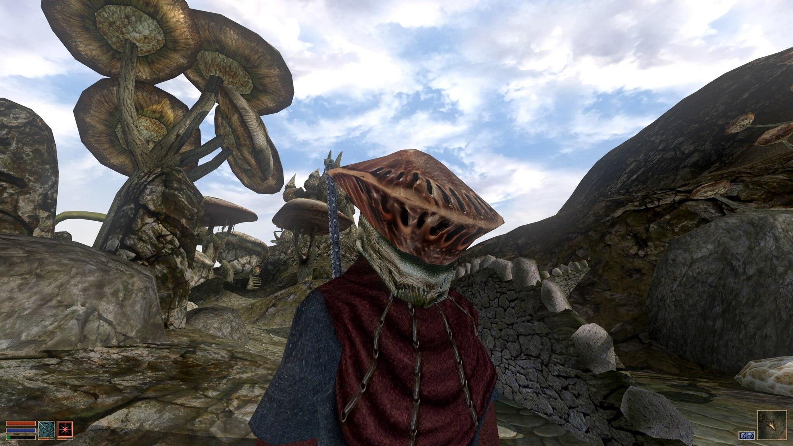

I'll spare you the tale of the savior of `Vvardenfall` and tell you the lesser known details of the Nerevarine.

Etria wore dark red peasant robes, gloves, and hid their race behind a common Redoran watchman's helmet (perhaps for this reason they were hated by the Redoran). Despite being the native race to Morrowind, the dark elves, they never let this show - their pale gloves often being mistaken for Breton. It is perhaps due to the hatred they received from the House Redoran that Etria found alliance with the House Telvanni - though a great many mysterious deaths of high Telvanni house members occurred at this time.

Etria later wore a second heretical piece - stolen from the High Ordinators of the Tribunal, they wore "Her Hand's" armor shoulder pauldrons, holes cut in their robes, enchanted with an intimidating glow. Perhaps like the Redoran helmet, Etria had a disdain for the governing order of the realms. No doubt pissing off any member of the two clans on sight. 

Etria favored a slinder samurai sword and through either desturction magic or the use of oils, it was said to glow red hot as it would strike their foes down. 

That was who Etria was - an oursider - and they wore it literally. 

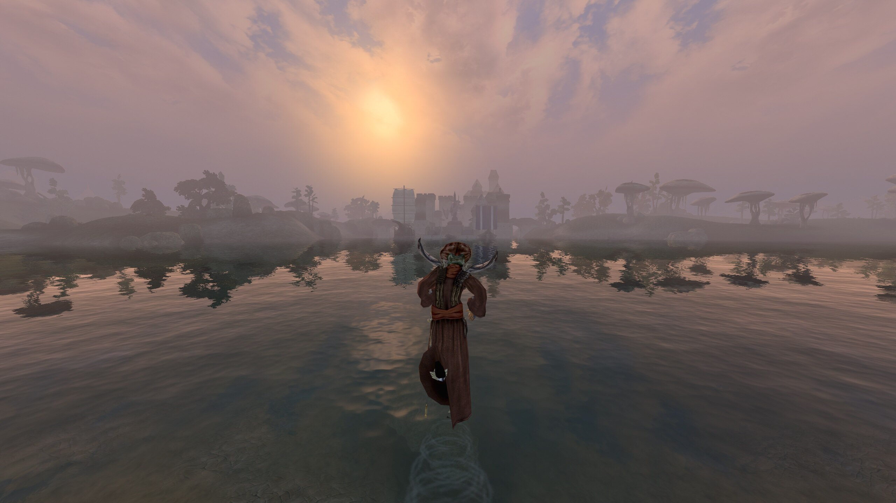

After the Red Ash stopped falling, Etria walked across the water south near `Vivec` to `Old Ebonheart` and down the Thirr river. The simple, rural people of this area were in awe of the water-walker and had not yet heard of the strife in `Vvardenfall`, only murmors of old gods. A great many plantations existed along the river, providing goods into the heart of Vvardenfell - but it is said that Etria went on a rampage. Killing numerous plantation owners and rich families and freeing every slave Argonian and Khajit. With their army, they settled in `Roa Dyr` the city of lights, and controled the ports of `Aimrah` to `Almas Thirr`. 

Word of united tribal nations in `Vvardenfall` spread south from the island. Revealed as Nerevarine bought Etria a seat at the table of `Old Ebonheart` in the trade route to `Cyrodiil`. At the political table was the god-incarnate Vivec. And while having spared the God Vivec previously, Etrai ultimately killed Vivec to prove a point of forcing change on the land. Upon killing Vivec and with no magic to keep Vivec city's meteor in suspension, Etria is said to have sliced Vivec city's fallen meteor in half as it crashed between the sea of `Ebonheart` and `Old Ebonheart` saving the city of `Vivec`. A tidal wave wrecked the ships at `Old Ebonheart` port yet the castle held. This was enough of a threat to end slavery for good in the region. It is said that Etria grew bored of stubborn politicians and retired far-far south in the `Black Marshland` of the Argonians they had freed.

Etria was last seen along the `Aanthirin` river.

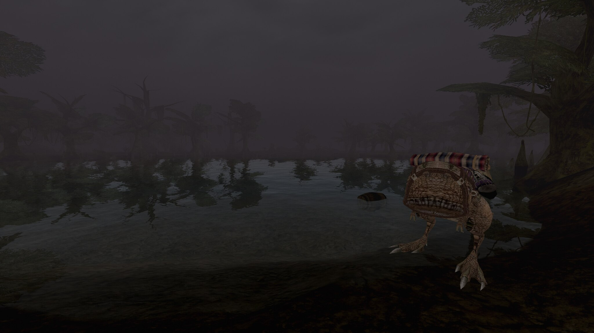
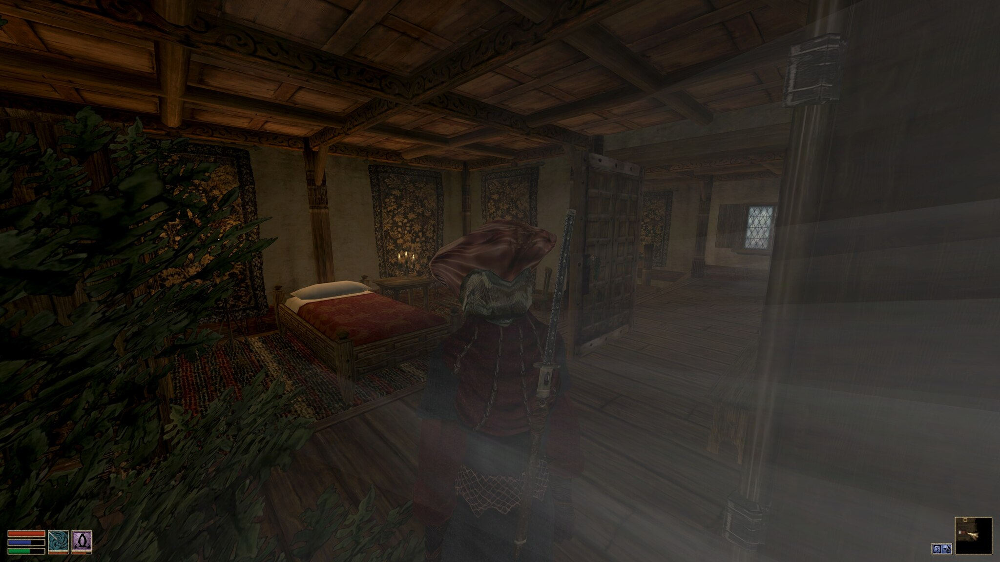
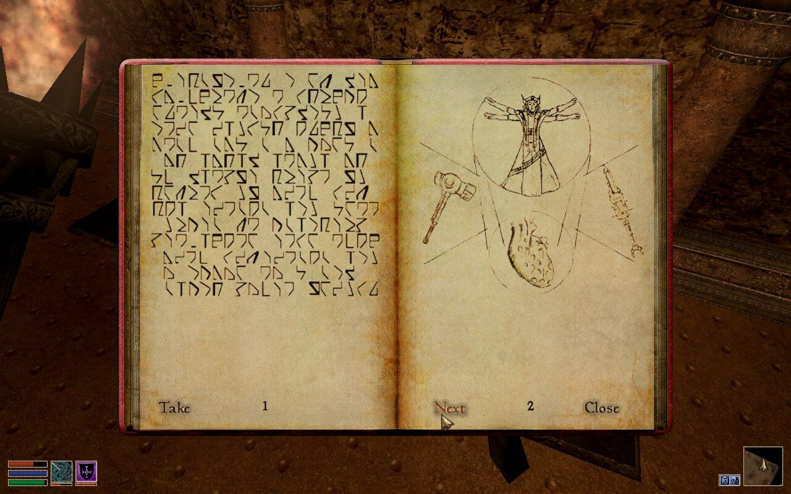