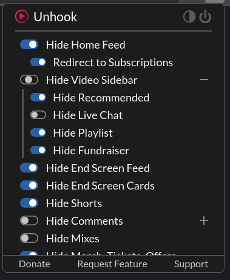
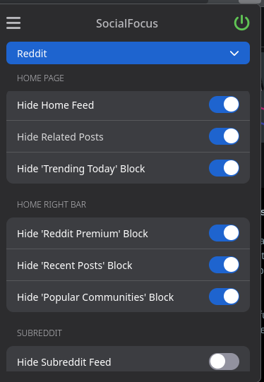
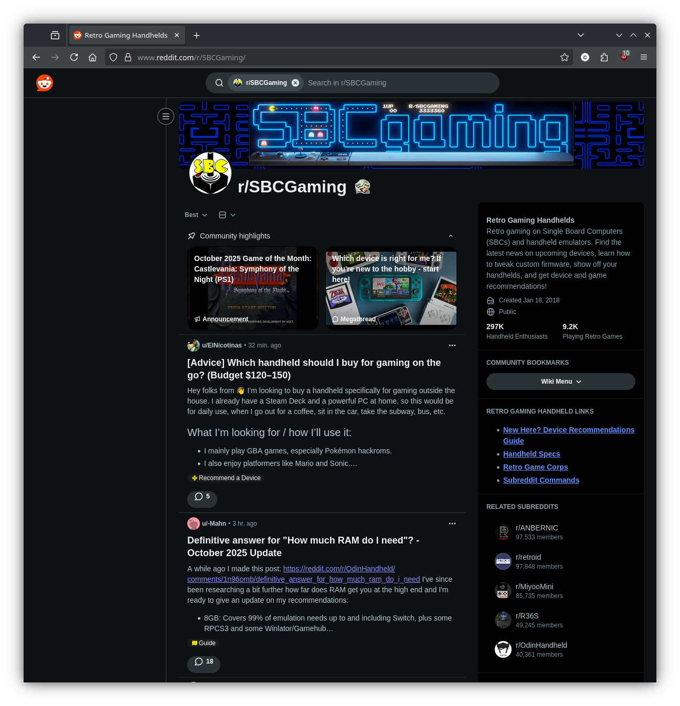

# Table of Contents
### Feed Removal: 
- [Overview](#the-smartphone-is-a-non-neutral-influence)
    - [What does NOT Work (for me)](#what-does-not-work-for-me)
    - [What Works (for me)](#what-works-for-me)
- [Phone Apps vs Browsers Extensions](#phone-apps-vs-browsers-extensions)
    - [Forcibly removing google apps with addictive feeds](#removing-google-apps)
- [Firefox Extensions](#firefox-extensions)
    - [Ad Block - uBlock-Origin](#ad-block---ublock-origin)
    - [Youtube - hide the feed - unHOOK](#youtube---hide-the-feed---unhook)
    - [Reddit & Others - hide the feed - SocialFocus](#reddit--others---hide-the-feed---socialfocus)
    - [(optional) redirector](#optional-redirector)

### Lifestyle:
- [Operating Systems](#operating-system---ditching-windows)
- [Great Apps to use](#great-apps-to-actually-use)
- [Great Devices to use](#great-devices-to-use-that-arent-a-smartphone)

# The Smartphone is a Non-neutral influence

It's not your fault when you spend too much time on your smartphone. There are thousans of corporate entities that have designed this rectangle to be as addictive and engaging as possible. And if you don't want to be zombified in the process, then you'll have to engage in a creative sort of mental warfair. 

Here's what you can do about it. Here's how you can stay connected to the friends and information of the internet that enriches your life while disabling the algorithmic feed from view. 

## What does NOT work (for me)

### App Timers
App timers give you a button to ignore and reset at midnight - which is a problem if you stay up. They don't have an option of resetting at say 6AM. 

### Abstinence / Dumb Phone

See [Great Apps to actually use](#great-apps-to-actually-use) - but I think most of us like <i>some</i> components of modern internet life.

## What Works (for me)

For the most part, I block the algorithmic feed of sites like youtube/reddit, while still having some access to certain areas like subscriptions or subreddits. This is a balance and may not work well for everyone, but this guide is to help by providing detail of that balance.

<table style="font-size:18px; border-collapse: collapse; border: 1px solid #ccc;">
  <tr>
    <th style="border: 1px solid #ccc; padding: 4px;"></th>
    <th style="border: 1px solid #ccc; padding: 4px;">Phone</th>
    <th style="border: 1px solid #ccc; padding: 4px;">Browser</th>
    <th style="border: 1px solid #ccc; padding: 4px;">TV</th>
  </tr>
  <tr>
    <td style="border: 1px solid #ccc; padding: 4px;">Chrome</td>
    <td style="border: 1px solid #ccc; padding: 4px;">✘ App Forcibly Removed</td>
    <td style="border: 1px solid #ccc; padding: 4px;">✘</td>
    <td style="border: 1px solid #ccc; padding: 4px;"></td>
  </tr>
  <tr>
    <td style="border: 1px solid #ccc; padding: 4px;">Firefox</td>
    <td style="border: 1px solid #ccc; padding: 4px;">✔</td>
    <td style="border: 1px solid #ccc; padding: 4px;">✔</td>
    <td style="border: 1px solid #ccc; padding: 4px;"></td>
  </tr>
  <tr>
    <td style="border: 1px solid #ccc; padding: 4px;">Discord</td>
    <td style="border: 1px solid #ccc; padding: 4px;">✔</td>
    <td style="border: 1px solid #ccc; padding: 4px;">✔</td>
    <td style="border: 1px solid #ccc; padding: 4px;"></td>
  </tr>
  <tr>
    <td style="border: 1px solid #ccc; padding: 4px;">Reddit</td>
    <td style="border: 1px solid #ccc; padding: 4px;">✘ App<br/>✇ Feed restricted</td>
    <td style="border: 1px solid #ccc; padding: 4px;">✇ Feed restricted</td>
    <td style="border: 1px solid #ccc; padding: 4px;"></td>
  </tr>
  <tr>
    <td style="border: 1px solid #ccc; padding: 4px;">Youtube</td>
    <td style="border: 1px solid #ccc; padding: 4px;">✘ App Forcibly Removed<br/>✇ Feed restricted</td>
    <td style="border: 1px solid #ccc; padding: 4px;">✇ Feed restricted</td>
    <td style="border: 1px solid #ccc; padding: 4px;">✘ <a href="https://smarttubeapp.github.io/">App Replacement</a><br/>✇ Feed restricted</td>
  </tr>
  <tr>
    <td style="border: 1px solid #ccc; padding: 4px;">Facebook</td>
    <td style="border: 1px solid #ccc; padding: 4px;">✘</td>
    <td style="border: 1px solid #ccc; padding: 4px;">✘</td>
    <td style="border: 1px solid #ccc; padding: 4px;"></td>
  </tr>
  <tr>
    <td style="border: 1px solid #ccc; padding: 4px;">Twitter</td>
    <td style="border: 1px solid #ccc; padding: 4px;">✘</td>
    <td style="border: 1px solid #ccc; padding: 4px;">✘</td>
    <td style="border: 1px solid #ccc; padding: 4px;"></td>
  </tr>
  <tr>
    <td style="border: 1px solid #ccc; padding: 4px;">Tiktok</td>
    <td style="border: 1px solid #ccc; padding: 4px;">✘</td>
    <td style="border: 1px solid #ccc; padding: 4px;">✘</td>
    <td style="border: 1px solid #ccc; padding: 4px;"></td>
  </tr>
  <tr>
    <td style="border: 1px solid #ccc; padding: 4px;">Linkedin</td>
    <td style="border: 1px solid #ccc; padding: 4px;">✘</td>
    <td style="border: 1px solid #ccc; padding: 4px;">✘</td>
    <td style="border: 1px solid #ccc; padding: 4px;"></td>
  </tr>
  <tr>
    <td style="border: 1px solid #ccc; padding: 4px;">Other Socials</td>
    <td style="border: 1px solid #ccc; padding: 4px;">✘</td>
    <td style="border: 1px solid #ccc; padding: 4px;">✘</td>
    <td style="border: 1px solid #ccc; padding: 4px;"></td>
  </tr>
  <tr>
    <td style="border: 1px solid #ccc; padding: 4px;">Microsoft Teams</td>
    <td style="border: 1px solid #ccc; padding: 4px;">✘</td>
    <td style="border: 1px solid #ccc; padding: 4px;">✘</td>
    <td style="border: 1px solid #ccc; padding: 4px;"></td>
  </tr>
</table>


# Phone Apps vs Browsers Extensions

Chrome on android does not have extensions. <u>Firefox does.</u> In order to get access to a site like youtube without the algorithmic feed, we have to one remove the app and two use browser extensions to modify the presentation of the site.

Google does not let you uninstall the chrome and youtube app <u>but you can by force.</u>

## Forcibly removing google apps with addictive feeds

To remove chrome and youtube apps from your phone, you first must setup on a PC [Android Developer Bridge (adb)](https://developer.android.com/tools/adb) and then run the following commands:

```bash
adb shell pm uninstall --user 0 com.android.chrome

adb shell pm uninstall --user 0 com.google.android.youtube
```
# Firefox extensions

I recommend installing these extensions on both your phone and PC usage.

## Ad Block - [uBlock-Origin](https://github.com/gorhill/uBlock#ublock-origin)

Fuck ads.

## Youtube - hide the feed - [unHOOK](https://unhook.app/)

Disable the home feed, restrict to subscriptions.

Once a week, it's ok to enable the home feed and poke around the algorithm for new content. Queue up some new videos or subscriptions - just keep in mind the FEED is the addictive controlling part of these sites, even simply redirecting from it to your subscriptions can have an impact.

Keep your subscriptions relevant and tailored to YOU. Don't remake the feed.



## Reddit & Others - hide the feed - [SocialFocus](https://socialfocus.app/)

This can be redundant to youtube-unhook, but I use it only for Reddit.

* Facebook
* Gmail
* Instagram
* LinkedIn
* Reddit
* Twitter
* YouTube



<!--  -->


## (optional) [Redirector](https://einaregilsson.com/redirector/)

If you find yourself navigating to undesirable pages like `r/politics`, consider making a rule to redirect you to somewhere else or a blank page.

# Operating System - ditching Windows

- [Fedora](https://fedoraproject.org/)
- [Debian](https://www.debian.org/)
- [Arch](https://archlinux.org/)

# GREAT APPS to actually use

## Android Launcher

### [Niagara Launcher](https://play.google.com/store/apps/details?id=bitpit.launcher&hl=en-US)
Just a nice homepage launcher that does let you hide apps, which can be a start or alternative if you don't want to use ADB to remove certain apps, but have friction in getting to them. 

## Reading
### [StoryGraph](https://thestorygraph.com/)
A way to track your reading. An excellent replacement to the amazon owned goodreads.

### [Libby / Overdrive](https://libbyapp.com)
Using your local library card, gain access to an impressive amount of audiobooks and ebooks.

### [Calibre ebook management (PC)](https://calibre-ebook.com/)
calibre is a powerful and easy to use e-book manager. 

### [mpv](https://mpv.io/)
commandline media player that will play files and youtube urls

## Gaming

### [Retroarch](https://www.retroarch.com/)
RetroArch is a frontend for emulators

# GREAT DEVICES to use that aren't a smartphone

## [Kobo e-readers](https://us.kobobooks.com/collections/eReaders)

Unlike amazon kindle's locked ecosystem, kobo lets you manage files via USB and supports modification with interfaces like [KOReader](https://koreader.rocks/)

## [Supernote 7"](https://supernote.com/)

Great for writing, not recommended for reading.

## Gaming Handhelds


### [Steam Deck](https://store.steampowered.com/steamdeck)
Running linux, a steam deck lets you play steam and non-steam games and is extremely customizable.

### 3DS

### [Miyoo Mini Plus](https://retrogamecorps.com/2022/05/15/miyoo-mini-v2-guide/)

### [Anbernic](https://retrogamecorps.com/2024/06/07/anbernic-rg35xx-family-starter-guide/) (rg34xx)

### [Retroid](https://www.goretroid.com/)